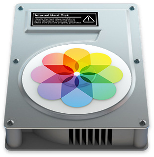

# apple-photos-export



An Apple Photos export script.

**Please note that `apple-photos-export.py` has been written to fit _my_ (perhaps uncommon) use case.** *It's only been tested for photos imported into an Apple Photos library via USB from an iPhone – I haven't yet tried how importing media from other sources or using iCloud changes things. I don't use Apple Photos for anything else. My iPhone has always been set to use the HEIC format, Live Photos have always been enabled and for HDR photos, the non-HDR variant is also stored. Lastly, I've got an iPhone 7 – so the script might not work for Portrait mode photos.* **Not much care was taken to make it particularly useful to anyone else. Most notably, it's *not an all-purpose backup tool* (I don't think one exists). Continue reading to find out what exactly it does.**

*Note that I'm stuck on Mojave, i.e. Photos 4.0, for the time being – I don't yet know if this script works on Catalina.*

---


## Setup and usage

1. Install `exiftool` and `python3`.
2. Make sure `sips` is working (this should be included in your macOS installation).
3. `pip3 install configfile`.
4. Copy `apple-photos-export.ini.example` to `apple-photos-export.ini` in your desired target path (and fill in the details).

With this setup work out of the way, all that's left is to plug your iPhone into your MacBook, import all (or some) photos and run:

```sh
python3 apple-photos-export.py TARGET [-v]
```

This will read the config file, export all media [to a location within the depths of `/tmp` and only upon your confirmation copy them] to the `TARGET`, structured as shown below. Additionally, a cache file `TARGET/apple-photos-export.json` containing a record of already-exported photos and some metadata will be created.

```text
TARGET
├── 2018/
│   ├── 09_September/
│   │   ├── 2018-09-22_09-02-04_3_selfie_IMG_0001.heic                        # Taken with front-facing camera and...
│   │   ├── 2018-09-22_09-02-04_3_selfie_IMG_0001.jpg                         # ...generated JPEG version and...
│   │   ├── 2018-09-22_09-02-04_3_selfie_jpegvideocomplement_1.mov            # ...matching Live Photo video.
│   │   ├── ...
│   │   ├── 2018-09-22_09-19-47_6_slomo_IMG_0004.mov                          # Slomo (recorded at O(many) fps, played at same frame rate, so doesn't appear to be a slomo) and...
│   │   ├── 2018-09-22_09-19-47_6_slomo_rendered_fullsizeoutput_35d.mov       # ...rendered version (part of the video is actually slowed down).
│   │   ├── 2018-09-22_09-20-12_7_IMG_0005.mov                                # Video.
│   │   ├── 2018-09-22_09-20-39_8_panorama_IMG_0008.heic                      # Panorama and...
│   │   ├── 2018-09-22_09-20-39_8_panorama_IMG_0008.jpg                       # ...generated JPEG.
│   │   ├── 2018-09-22_09-20-47_9_panorama_IMG_0009.heic
│   │   ├── 2018-09-22_09-20-47_9_panorama_IMG_0009.jpg
│   │   ├── ...
│   │   ├── 2018-09-23_15-47-58_24_IMG_0025.heic                              # Normal photo and...
│   │   ├── 2018-09-23_15-47-58_24_IMG_0025.jpg                               # ...generated JPEG version and...
│   │   ├── 2018-09-23_15-47-58_24_jpegvideocomplement_e.mov                  # ...matching Live Photo video.
│   │   ├── 2018-09-23_15-48-33_25_slomo_IMG_0026.mov
│   │   ├── 2018-09-23_15-48-33_25_slomo_rendered_fullsizeoutput_363.mov
│   │   ├── 2018-09-23_15-49-15_26_slomo_IMG_0027.mov
│   │   ├── 2018-09-23_15-49-15_26_slomo_rendered_fullsizeoutput_36b.mov
│   │   ├── 2018-09-23_17-31-12_27_IMG_0028.heic
│   │   ├── 2018-09-23_17-31-12_27_IMG_0028.jpg
│   │   ├── 2018-09-23_17-31-12_27_jpegvideocomplement_f.mov
│   │   ├── 2018-09-23_17-31-50_28_IMG_0029.heic
│   │   ├── 2018-09-23_17-31-50_28_IMG_0029.jpg
│   │   ├── 2018-09-23_17-31-50_28_jpegvideocomplement_10.mov
│   │   ├── ...
│   │   ├── 2018-09-28_04-33-44_53_IMG_0056.heic
│   │   ├── 2018-09-28_04-33-44_53_IMG_0056.jpg
│   │   ├── 2018-09-28_04-33-44_53_jpegvideocomplement_23.mov
│   │   ├── 2018-09-28_04-34-25_54_burst_EAycz5MaTtGjHW7d3PEvXw_IMG_0057.jpg  # Burst...
│   │   ├── 2018-09-28_04-34-25_55_burst_EAycz5MaTtGjHW7d3PEvXw_IMG_0058.jpg  # ...photo...
│   │   ├── 2018-09-28_04-34-25_56_burst_EAycz5MaTtGjHW7d3PEvXw_IMG_0059.jpg  # ...from...
│   │   ├── 2018-09-28_04-34-25_57_burst_EAycz5MaTtGjHW7d3PEvXw_IMG_0060.jpg  # ...same...
│   │   ├── 2018-09-28_04-34-26_58_burst_EAycz5MaTtGjHW7d3PEvXw_IMG_0061.jpg  # ...burst...
│   │   ├── 2018-09-28_04-34-26_59_burst_EAycz5MaTtGjHW7d3PEvXw_IMG_0062.jpg  # ...as...
│   │   ├── 2018-09-28_04-34-26_60_burst_EAycz5MaTtGjHW7d3PEvXw_IMG_0063.jpg  # ...all...
│   │   ├── 2018-09-28_04-34-26_61_burst_EAycz5MaTtGjHW7d3PEvXw_IMG_0064.jpg  # ...of...
│   │   ├── 2018-09-28_04-34-26_62_burst_EAycz5MaTtGjHW7d3PEvXw_IMG_0065.jpg  # ...these...
│   │   ├── 2018-09-28_04-34-26_63_burst_EAycz5MaTtGjHW7d3PEvXw_IMG_0066.jpg  # ...other...
│   │   ├── 2018-09-28_04-34-26_64_burst_EAycz5MaTtGjHW7d3PEvXw_IMG_0067.jpg  # ...burst...
│   │   ├── 2018-09-28_04-34-26_65_burst_EAycz5MaTtGjHW7d3PEvXw_IMG_0068.jpg  # ...photos.
│   │   └── ...
│   ├── 10_October/
│   │   ├── ...
│   │   ├── 2018-10-21_15-51-15_269_IMG_0271.heic
│   │   ├── 2018-10-21_15-51-15_269_IMG_0271.jpg
│   │   ├── 2018-10-21_15-51-15_269_jpegvideocomplement_b3.mov
│   │   ├── 2018-10-21_15-51-15_270_instagram_IMG_0272.jpg                    # Edited using Instagram.
│   │   ├── ...
│   └── ...
├── 2019/
│   └── ...
├── apple-photos-export.ini   # Settings.
└── apple-photos-export.json  # Cache.
```


## The (not) very interesting backstory

Back in the olden days, when I was using an Android-powered Nexus 5 and Dropbox's "Camera Uploads" feature, everything was great:

1. The phone would save photos (whether HDR or not) as `.jpg`, videos as `.mp4` and screenshots as `.png`.
2. Dropbox would continuously collect them and they'd end up on a folder on my laptop (with more or less sensible, time-based filenames), from where I could periodically archive them to a big external disk (and a backup, of course).

Then I got myself an iPhone, which – in addition to "normal" photos and videos – takes Live Photos, for which Dropbox only uploads the "base" photo. To make matters worse, some apps such as WhatsApp store received images in the camera roll, which messes everything up unless some filtering is done. In a futile attept to future-proof things (and for portability), I thought it'd be neat to generate a JPEG version of all HEIC files.

Wanting to keep my previous archival scheme running (and having it be complete, i.e. also containing the short videos corresponding to live photos), I've come up with the following workflow:

1. Connect the iPhone to my MacBook via USB.
2. Import all new photos into Photos.app.
3. ??? (this is where `apple-photos-export.py` comes in).
4. PROFIT!!!


## Notes on `photos.db` and the directory structure of `~/Pictures/Apple Photos.photoslibrary`

*Current as of February 2019 (iOS 12.1.2, macOS 10.14.2 Mojave, Photos 4.0).*

In order to write `apple-photos-export.py`, I needed to reverse-engineer how Apple Photos stores and keep track of photos. Initially, this promised to be a piece of cake since Photos, inside the `Photos Library.photoslibrary`, uses an SQLite database `Photos Library.photoslibrary/database/photos.db` to keep track of the run-of-the-mill files it imports.

Upon further investigation, this proved a bit frustrating since the database really doesn't seem to contain much of the detail needed to get to the Live Photo videos and, to a lesser degree, discern different types of media – and what's more, it's not consistent in terms of setting a consistent set attributes to consistent values for a given kind of media. No idea how Apple Photos itself deals with this – but my solutions to these issues are encoded in `apple-photos-export.py`. The following SQL query gives sort of an overview:

```sql
SELECT modelId,               -- ID
       imagePath,             -- Absolute path to the base image.
       fileModificationDate,  -- Useful for matching slomo videos with rendered variants auto-generated by Photos.
       mediaGroupId,          -- Corresponds to the ContentIdentifier EXIF key in Live Photo videos, required for matching.
       groupingUuid           -- NULL for panoramas and squares, among others.
       burstUuid,             -- If set, we're dealing with a photo taken in burst mode (this allows grouping of bursts; also RKVersion contains a column burstPickType which I think indicates the best picture of a given burst).
       UTI,                   -- File type, commonly one of: public.heic, public.jpeg (WhatsApp/burst/panorama), com.apple.quicktime-movie, public.png, public.mpeg-4 (WhatsApp videos).
       importGroupUuid,       -- The import group (each time you import some pictures into Photos, an import group is created) the picture is part of. Allows trivially ignoring previously-exported imports for a significant speedup.
       hasAttachments         -- Indicates whether Photos has created a rendered slomo video or if you've performed any edits to the photo.
FROM RKMaster                 -- Most important table, also worth taking a look at: RKVersion, RKAttachment.
```

A commented tree view of the directory structure of `Photos Library.photoslibrary`:

```text
Photos Library.photoslibrary
├── Attachments/          # Not-really-useful metadata for adjustments.
│   └── ...
├── Masters/              # Master (original, un-edited) photos, organized in subdirectories according to import group dates.
│   ├── 2018/
│   │   └── 12/
│   │       └── 28/
│   │           └── 20181228-132551/
│   │               ├── IMG_0001.HEIC
│   │               ├── IMG_0002.HEIC
│   │               └── ...
│   └── 2019/
│       └── ...
├── database/             # Database and database-related files.
│   ├── photos.db
│   └── ...
├── private/
│   └── ...
└── resources/
    ├── media/
    │   ├── face/         # Extracted (and partially somewhat distorted) faces in image form (Photos might take a few days of background processing to populate this directory).
    │   │   └── ...
    │   ├── master/       # Live Photo videos (among some other stuff, like JPEG versions of screenshots).
    │   │   ├── 00/
    │   │   │   └── 00/
    │   │   │       ├── fullsizeoutput_fe.jpeg
    │   │   │       ├── ...
    │   │   │       ├── jpegvideocomplement_1.mov
    │   │   │       ├── jpegvideocomplement_10.mov
    │   │   │       ├── jpegvideocomplement_11.mov
    │   │   │       ├── ...
    │   │   │       └── jpegvideocomplement_ff.mov
    │   │   └── ...
    │   ├── t/
    │   │   └── ...
    │   └── version/      # Rendered slomo videos and rendered versions of edited photos.
    │       ├── 00/
    │       │   └── 00/
    │       │       ├── fullsizeoutput_16.jpeg
    │       │       └── fullsizeoutput_22.jpeg
    │       ├── 03/
    │       │   └── 00/
    │       │       ├── fullsizeoutput_35d.mov
    │       │       ├── fullsizeoutput_363.mov
    │       │       └── fullsizeoutput_36b.mov
    │       └── 05/
    │           └── 00/
    │               ├── fullsizeoutput_521.jpeg
    │               └── videocomplementoutput_522.mov
    ├── moments/          # Some .plist files, nothing much useful.
    │   └── ...
    ├── projects/
    ├── proxies/
    │   └── derivatives/  # Thumbnails.
    │       └── ...
    ├── recovery/         # Database backups in some weird format, I think.
    │   ├── Info.plist
    │   ├── RKAdjustmentData/
    │   │   └── 0000000000.lij
    │   └── ...
    └── segments/
        └── ...
```


## Related work

* https://github.com/RhetTbull/osxphotos
* https://github.com/RhetTbull/photosmeta


## Future work

* [ ] iCloud support.
* [ ] Named faces support (don't yet use this feature; take a look at https://github.com/SummittDweller/merge-photos-faces/blob/master/main.py and https://github.com/patrikhson/photo-export/blob/master/photo.py).
* [ ] Portrait mode support (don't have the required hardware).
* [ ] Maybe export rendered variants of edited photos (take a look at https://github.com/orangeturtle739/photos-export)?
* [ ] ...
